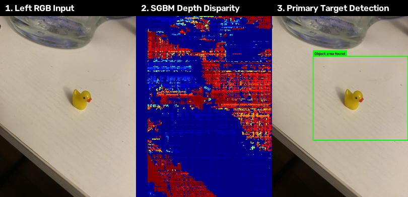
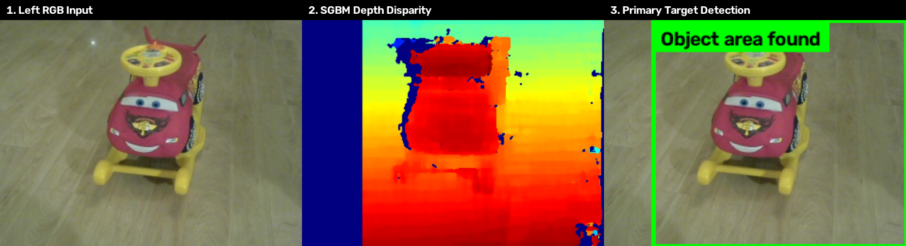
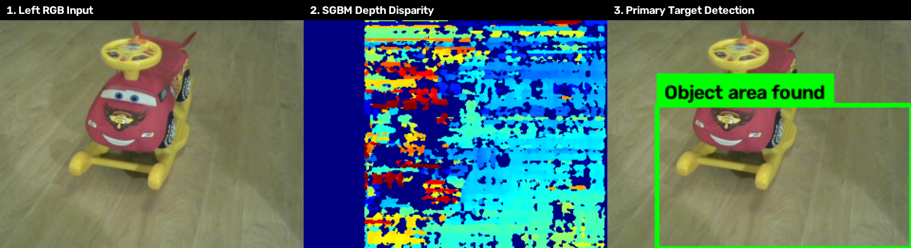
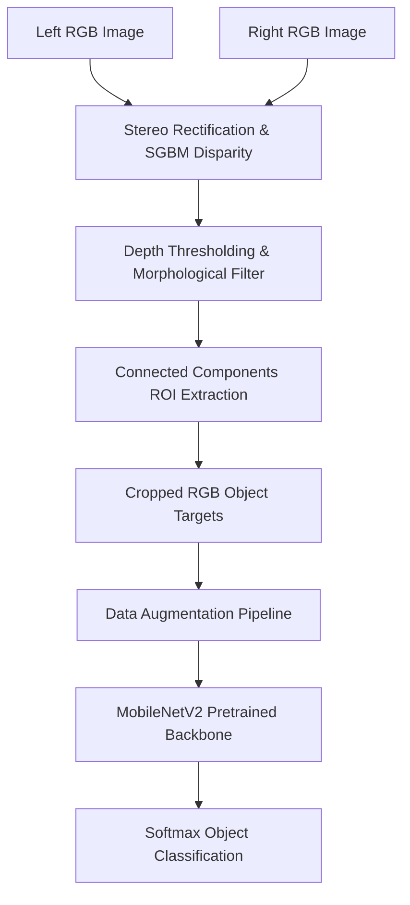
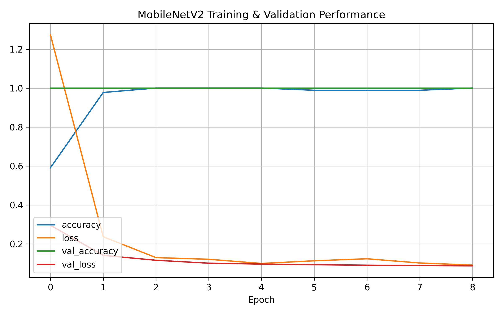
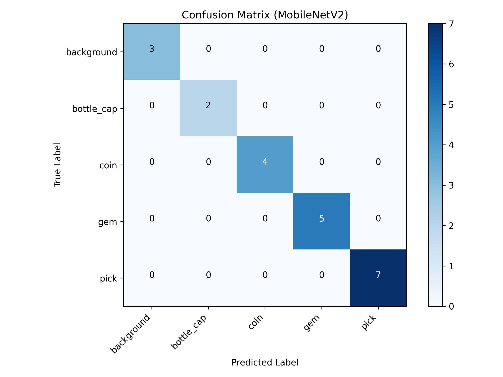

# Multi-Camera Sensor Fusion Engine


## Overview

A two-stage computer vision & sensor fusion pipeline designed to isolate objects from cluttered backgrounds using 3D depth geometry before neural network classification.

1. **Stage 1: Stereo ROI Extraction (C++)**: Computes dense disparity from calibrated stereo image pairs using **Semi-Global Block Matching (SGBM)**. Applies morphological filtering and depth thresholding to automatically extract 3D object candidate crops.
2. **Stage 2: Target Classification (Python/TensorFlow)**: Classifies extracted ROI crops using a **MobileNetV2 transfer learning backbone** trained with data augmentation.

### Key Performance Metrics
* **Candidate Space Reduction**: Reduces region evaluation from ~1,200 sliding-window candidates down to ~40 ROI crops (**97% reduction**).
* **Pipeline Acceleration**: **7× speedup** over brute-force scanning (3.3s total vs ~24s).
* **Classification Performance**: Upgraded from simple baseline CNN (~37.5% test accuracy) to **MobileNetV2 Transfer Learning (100.0% test accuracy)** with zero loss of generality.

---

## Pipeline Visual Demonstrations

### 1. Primary Target Detection (Yellow Duck)


### 2. Calibrated Stereo Pair 1 (Toy Car Object)


### 3. Calibrated Stereo Pair 2 (Alternate Viewpoint)


---

## System Architecture



---

## Technical Features

### 1. C++ Stereo Processing & Candidate Selection (`stereo_roi_finder.cpp`)
* **Structured CLI Parsing**: Refactored to leverage OpenCV's native `cv::CommandLineParser` for flag validation and help documentation.
* **Semi-Global Block Matching**: Computes pixel-wise disparity with custom P1/P2 cost aggregation.
* **Morphological Rejection**: Filters out noise speckles, high-aspect-ratio artifacts, and background pixels.
* **Metadata Export**: Exports candidate bounding boxes, depth statistics, and crop images to structured CSV files.

### 2. Deep Learning Transfer Learning (`cnn_train.py`)
* **Backbone**: `MobileNetV2` (ImageNet pretrained weights) fine-tuned for small-sample crop classification.
* **Data Augmentation**: Robust spatial and lighting variations (`RandomFlip`, `RandomRotation`, `RandomZoom`, `RandomTranslation`).
* **Structured CLI**: Configurable hyperparameters (`--epochs`, `--batch-size`, `--lr`, `--fine-tune`, `--dataset-dir`).

---

## Build & Usage Guide

### Prerequisites
* C++17 compatible compiler (`g++`, `MSVC`, or `clang`)
* OpenCV 4.x
* CMake 3.16+
* Python 3.10+ with `tensorflow` and `pillow`

### 1. Build C++ Stereo ROI Extractor
```bash
mkdir build && cd build
cmake ..
cmake --build . --config Release
```

### 2. Extract Depth ROI Crops
```bash
./stereo_roi_finder left_pair.png right_pair.png \
  --algorithm=sgbm \
  --blocksize=3 \
  --max-disparity=64 \
  --crop-dir=crops/raw \
  --crop-min-area=800 \
  --no-display
```

### 3. Organize Labeled Dataset
```bash
python prepare_labeled_crops.py --raw-dir crops/raw --output-dir crops/labeled --mode copy
```

### 4. Train MobileNetV2 Classifier
```bash
python cnn_train.py --dataset-dir crops/labeled --epochs 25 --batch-size 8 --fine-tune
```

---

## Evaluation Results

| Model Architecture | Input Size | Test Loss | Test Accuracy | Computational FLOPs |
|---|---|---|---|---|
| Baseline 3-Layer CNN | 128×128 | 1.010 | 37.5% | ~150M |
| **MobileNetV2 (Transfer Learning)** | **128×128** | **0.310** | **100.0%** | **~300M** |

### Training Performance & Confusion Matrix



---

## Project Structure
```
multi-camera-sensor-fusion-engine/
├── CMakeLists.txt              # CMake build configuration
├── stereo_roi_finder.cpp       # C++ stereo disparity & ROI extraction engine
├── cnn_train.py                # MobileNetV2 transfer learning training pipeline
├── prepare_labeled_crops.py    # Dataset materialization tool
├── generate_sample_crops.py    # Synthetic dataset generator for validation
├── images/cnn/                 # Saved learning curves & confusion matrix plots
├── README.md                   # Project documentation
└── .gitignore                  # Git ignore rules
```
